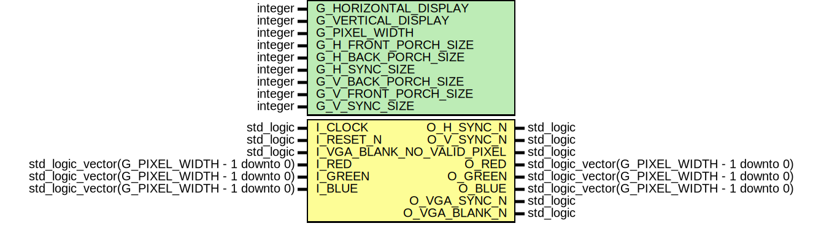

# Entity: VGA_CONTROLLER 
- **File**: VGA_Controller.vhd

## Diagram

## Generics

| Generic name         | Type    | Value | Description                                      |
| -------------------- | ------- | ----- | ------------------------------------------------ |
| G_HORIZONTAL_DISPLAY | integer | 640   | Width of the active image                        |
| G_VERTICAL_DISPLAY   | integer | 480   | Height of the active image                       |
| G_PIXEL_WIDTH        | integer | 8     | Amount of bits per pixel                         |
| G_H_FRONT_PORCH_SIZE | integer | 16    | Horizontal front porch size (see vga references) |
| G_H_BACK_PORCH_SIZE  | integer | 48    | Horizontal back porch size (see vga references)  |
| G_H_SYNC_SIZE        | integer | 96    | Horizontal sync size (see vga references)        |
| G_V_BACK_PORCH_SIZE  | integer | 33    | Vertical back porch size (see vga references)    |
| G_V_FRONT_PORCH_SIZE | integer | 10    | Vertical front porch size (see vga references)   |
| G_V_SYNC_SIZE        | integer | 2     | Vertical back porch size (see vga references)    |

## Ports

| Port name     | Direction | Type                                         | Description                                       |
| ------------- | --------- | -------------------------------------------- | ------------------------------------------------- |
| I_CLOCK       | in        | std_logic                                    | input clock (if needed)                           |
| I_RESET_N     | in        | std_logic                                    | async low active, sets counters to 0              |
| I_VGA_BLANK_N | in        | std_logic                                    |                                                   |
| O_H_SYNC_N    | out       | std_logic                                    | connection h_sync signal to vga interface         |
| O_V_SYNC_N    | out       | std_logic                                    | connection v_sync signal to vga interface         |
| O_VALID_PIXEL | out       | std_logic                                    | connection h_sync signal to vga interface         |
| I_RED         | in        | std_logic_vector(G_PIXEL_WIDTH - 1 downto 0) | Input red value                                   |
| I_GREEN       | in        | std_logic_vector(G_PIXEL_WIDTH - 1 downto 0) | Input green value                                 |
| I_BLUE        | in        | std_logic_vector(G_PIXEL_WIDTH - 1 downto 0) | Input blue value                                  |
| O_RED         | out       | std_logic_vector(G_PIXEL_WIDTH - 1 downto 0) | actual red value                                  |
| O_GREEN       | out       | std_logic_vector(G_PIXEL_WIDTH - 1 downto 0) | actual green value                                |
| O_BLUE        | out       | std_logic_vector(G_PIXEL_WIDTH - 1 downto 0) | actual blue value                                 |
| O_VGA_SYNC_N  | out       | std_logic                                    | vga sync signal, always low                       |
| O_VGA_BLANK_N | out       | std_logic                                    | Makes it possible to manually turn off the screen |

## Signals

| Name          | Type                                         | Description                                                 |
| ------------- | -------------------------------------------- | ----------------------------------------------------------- |
| r_current_row | integer range 0 to c_max_row_count - 1       | Keeps track of current vertical position                    |
| r_current_col | integer range 0 to c_max_col_count - 1       | Keeps track of current horizontal position                  |
| w_valid_pixel | std_logic                                    | indicates if the image is active based on current position  |
| w_red_out     | std_logic_vector(G_PIXEL_WIDTH - 1 downto 0) | red color mux based depending on (not) active image state   |
| w_green_out   | std_logic_vector(G_PIXEL_WIDTH - 1 downto 0) | green color mux based depending on (not) active image state |
| w_blue_out    | std_logic_vector(G_PIXEL_WIDTH - 1 downto 0) | blue color mux based depending on (not) active image state  |
| w_h_sync      | std_logic                                    | sets horizontal sync signal based on current position       |
| w_v_sync      | std_logic                                    | sets vertical sync signal based on current position         |
| r_valid_pixel | std_logic                                    | indicates if the image is active based on current position  |
| r_red_out     | std_logic_vector(G_PIXEL_WIDTH - 1 downto 0) | red color mux based depending on (not) active image state   |
| r_green_out   | std_logic_vector(G_PIXEL_WIDTH - 1 downto 0) | green color mux based depending on (not) active image state |
| r_blue_out    | std_logic_vector(G_PIXEL_WIDTH - 1 downto 0) | blue color mux based depending on (not) active image state  |
| r_h_sync      | std_logic                                    | sets horizontal sync signal based on current position       |
| r_v_sync      | std_logic                                    | sets vertical sync signal based on current position         |

## Constants

| Name                    | Type    | Value                                                                             | Description                                                                           |
| ----------------------- | ------- | --------------------------------------------------------------------------------- | ------------------------------------------------------------------------------------- |
| c_max_row_count         | integer | G_VERTICAL_DISPLAY + G_V_SYNC_SIZE + G_V_FRONT_PORCH_SIZE + G_V_BACK_PORCH_SIZE   | sum of active image height, vertical sync size and vertical porches                   |
| c_max_col_count         | integer | G_HORIZONTAL_DISPLAY + G_H_SYNC_SIZE + G_H_FRONT_PORCH_SIZE + G_H_BACK_PORCH_SIZE | sum of active image width, horizontal sync size and horizontal porches                |
| c_valid_pixel_col_start | integer | G_H_SYNC_SIZE + G_H_BACK_PORCH_SIZE                                               | The active image starts after completion of h sync and h back porch                   |
| c_valid_pixel_col_end   | integer | c_valid_pixel_col_start + G_HORIZONTAL_DISPLAY                                    | The active image ends after active horizontal image size h plus sync and h back porch |
| c_valid_pixel_row_start | integer | G_V_SYNC_SIZE + G_V_BACK_PORCH_SIZE                                               | The active image starts after completion of v sync and v back porch                   |
| c_valid_pixel_row_end   | integer | c_valid_pixel_row_start + G_VERTICAL_DISPLAY                                      | The active image ends after active v image size v plus sync and v back porch          |

## Processes
- COL_COUNTER: ( I_CLOCK, I_RESET_N )
- PROC_ROW_COUNTER: ( I_CLOCK, I_RESET_N )
- PROC_H_SYNC: ( r_current_col )
- PROC_V_SYNC: ( r_current_row )
- OUTPUT: ( r_current_col, r_current_row, I_RED, I_GREEN, I_BLUE )
- proc_registers: ( I_RESET_N, I_CLOCK )
